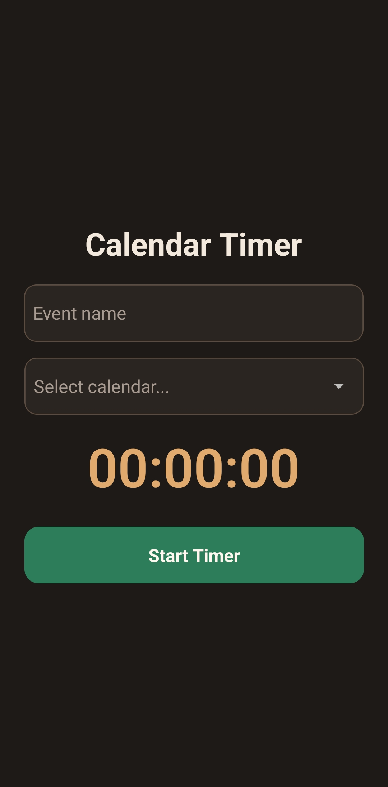
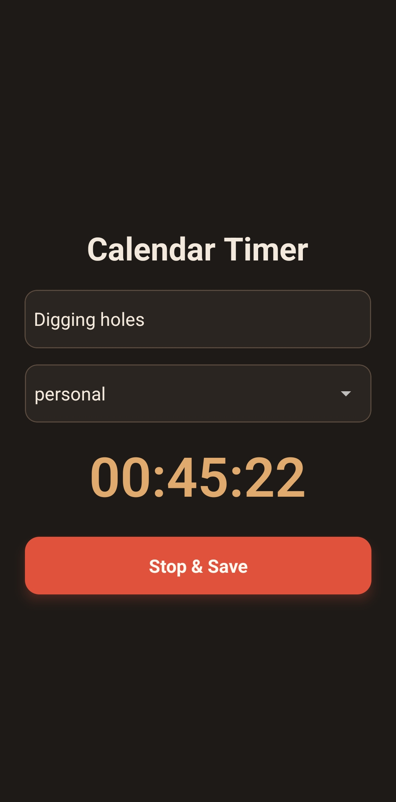
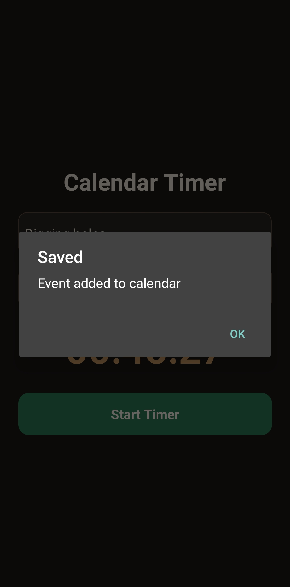

# Calendar Timer

## Summary

Wondering what you're doing all day? Now you can measure it. Calendar Timer helps you monitor and analyze how you spend your time by tracking time blocks and saving them in your calendar. Unlike other time tracking apps, Calendar Timer doesn't lock your data - it lets you store your time blocks with any calendar provider of your choice, keeping your information portable and under your control.
No telemetry, fully open source.

## Screenshots

<table>
  <tr>
    <td align="center">
      
    </td>
    <td align="center">
      
    </td>
    <td align="center">
      
    </td>
  </tr>
</table>

## Development

To run the Calendar Timer application in development mode:

1. Install dependencies
   ```bash
   npm install
   ```

2. Start the development server
   ```bash
   npm run android
   ```

## Build

To make a release build of the application:

1. Prebuild the project
   ```bash
   npx expo prebuild
   ```

2. Navigate to the Android directory
   ```bash
   cd android
   ```

3. Build the release version
   ```bash
   ./gradlew assembleRelease
   ```

## Notes

Only Android has been tested with this application. iOS should theoretically work as well since Expo supports cross-platform development, but it has not been verified.
